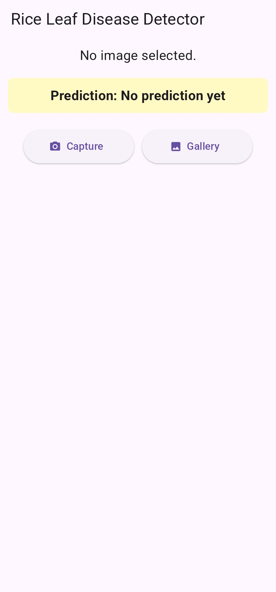
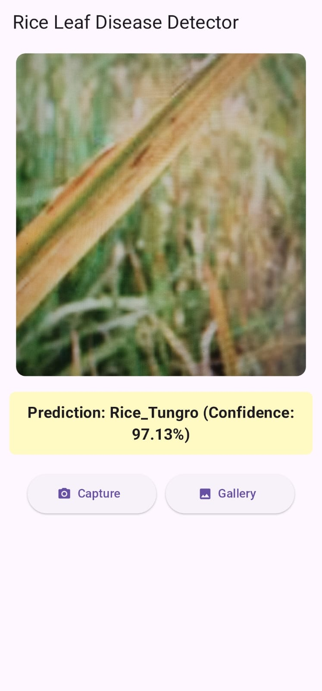
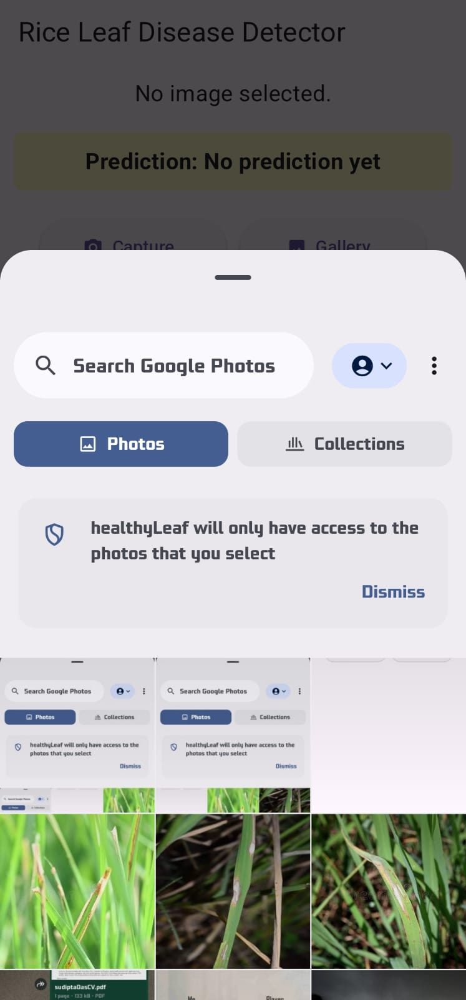
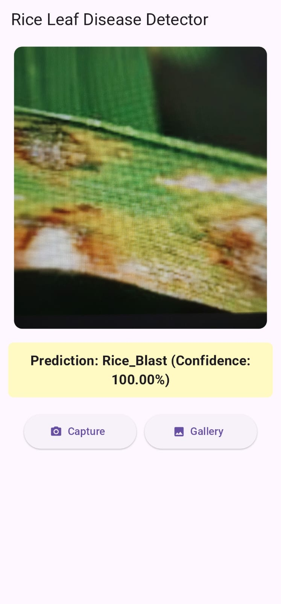
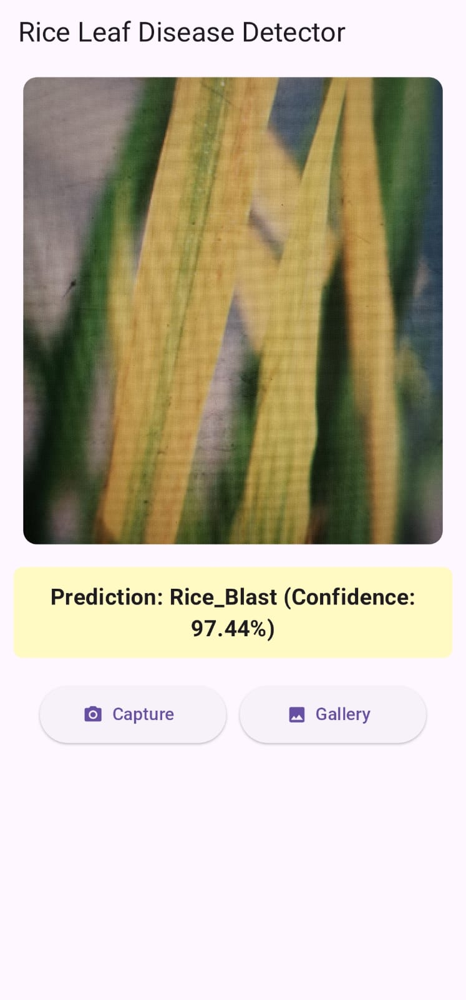

# 🍃 Leaf Disease Detector

A Flutter mobile application that detects **rice leaf diseases** using on-device Machine Learning powered by TensorFlow Lite.

---
## 📸 Screenshots

| Home | Camera | Gallery |
|------|--------|---------|
|  |  |  |

| Test 1 | Test 2 |
|--------|--------|
|  |  |

## 🌿 Features

- Detects **5 types** of rice leaf diseases using a custom-trained CNN model
- Supports **camera** and **gallery** image input
- Fully **offline** — inference runs on-device with TensorFlow Lite
- Clean, responsive UI built with Flutter

---

## 🛠️ Tech Stack

| Layer | Technology |
|---|---|
| Frontend | Flutter / Dart |
| ML Inference | TensorFlow Lite |
| Model | Custom CNN (trained from scratch) |
| Image Input | Camera + Gallery (image_picker) |

---

## 🔍 Disease Classes

The model classifies rice leaves into the following 5 categories:

| # | Class | Description |
|---|---|---|
| 1 | 🦠 Bacterial Blight | Bacterial infection causing yellowing and wilting |
| 2 | 💨 Blast | Fungal disease causing diamond-shaped lesions |
| 3 | 🟤 Brown Spot | Fungal spots on leaves and grains |
| 4 | ✅ Healthy | No disease detected |
| 5 | 🔴 Tungro | Viral disease causing yellow-orange discoloration |

---

## 🚀 Getting Started

### Prerequisites

- Flutter SDK ≥ 3.0
- Android Studio or VS Code
- A physical device or emulator (Android/iOS)

### Installation

```bash
git clone https://github.com/your-username/leaf-disease-detector.git
cd leaf-disease-detector
flutter pub get
flutter run
```

---

## 📁 Project Structure

```
lib/
├── main.dart
├── screens/
│   └── home_screen.dart
├── models/
│   └── classifier.dart
assets/
└── models/
    └── model.tflite
```

---

## 🤝 Contributing

Pull requests are welcome! For major changes, please open an issue first.

---

## 📄 License

This project is licensed under the MIT License.

---

## 👤 Author

**Sudipta Das**  
Flutter Developer | ML Enthusiast  
[LinkedIn](https://linkedin.com/in/your-profile) · [GitHub](https://github.com/your-username)
